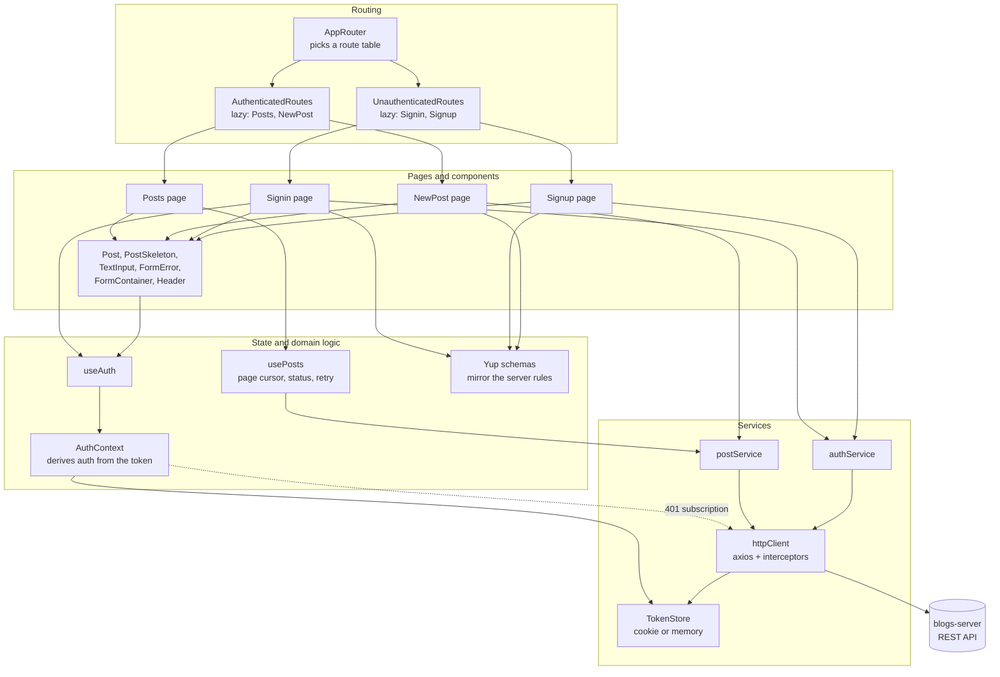
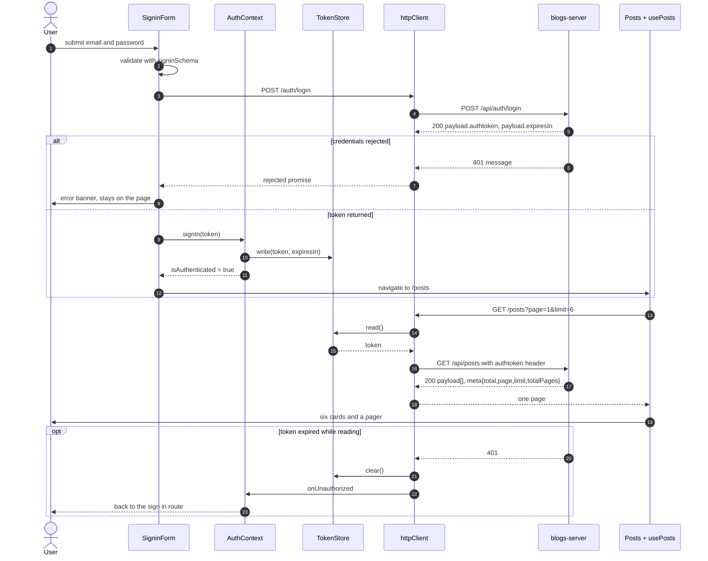

# blogs-web

The React client for [`blogs-server`](https://github.com/TCMS31/blogs-server): sign up, sign in for a token, read a
paginated feed of everyone's posts, and publish your own. It is a small single page app -
four routes, three forms and one list - written in TypeScript with Material UI.

It talks to exactly one backend and stores exactly one piece of state, the access token.
Everything else is derived.

## Screenshots

Captured with Playwright at 1440x900 against the production build and
[`scripts/mockApi.mjs`](scripts/mockApi.mjs), the bundled stand-in for `blogs-server`.

| The feed | Page two |
| --- | --- |
|  |  |

| Writing a post | A rejected sign in |
| --- | --- |
|  |  |

## Architecture

Dependencies point inward, and every arrow crosses exactly one layer. Pages never call
axios, and nothing below `hooks/` knows React exists.



## Main flow

Sign in, read a page, publish. The token is read from the store on every request rather
than captured once, which is what makes the second half of this diagram work at all.



## Quickstart

```bash
yarn install
cp .env.example .env.local        # optional: defaults to a same-origin /api

# Terminal 1 - a stand-in for blogs-server, no database required
yarn mock-api                      # http://localhost:8591/api

# Terminal 2 - the app
REACT_APP_API_URL=http://localhost:8591/api yarn start
```

Then open <http://localhost:3000> and sign in as `johndoe@example.com` / `abcd1234`.

To run against the real backend instead, start `blogs-server` and set
`REACT_APP_API_URL=http://localhost:8080/api`. Add the web origin to that server's
`CORS_ORIGINS` or the browser will block every request.

With Docker:

```bash
docker compose up --build          # http://localhost:8590
```

## Configuration

| Variable | Required | Default | Purpose |
| --- | --- | --- | --- |
| `REACT_APP_API_URL` | no | `/api` | Base URL of the blogs-server API, including the `/api` prefix. Inlined into the bundle at build time. The same-origin default is what the nginx image expects when the API is proxied under the same host. |
| `PORT` | no | `3000` | Port the development server binds to. Create React App convention. |
| `WEB_PORT` | no | `8590` | Host port published by `docker-compose.yml`. |
| `CI` | no | unset | Set to `true` to make the test runner exit instead of watching, and to make build warnings fatal. |
| `GENERATE_SOURCEMAP` | no | `true` | Set to `false` to skip source maps. The Dockerfile does. |

`REACT_APP_*` values are baked into the JavaScript bundle and are readable by anyone who
opens the page. Never put a secret in one.

## Development

```bash
yarn start        # dev server with fast refresh
yarn test         # jest in watch mode
yarn test:ci      # single run, the one CI should use
yarn coverage     # single run with a coverage table
yarn lint         # eslint, zero warnings tolerated
yarn typecheck    # tsc --noEmit
yarn format       # prettier over src/
yarn build        # production bundle into build/
yarn mock-api     # the offline stand-in for blogs-server
```

Tests never touch the network. `src/__mocks__/axios.js` replaces axios for every suite, and
`src/testUtils/` provides the provider wrapper and the response builders on top of it. The
two suites that need the real axios - the HTTP client's interceptors - opt back in with
`jest.unmock('axios')` and install a fake adapter.

`src/setupTests.ts` fails any test that writes to `console.error`, so React prop warnings
and `act` violations cannot accumulate unnoticed.

## Project structure

```
src/
  components/
    AppRoutes/        route tables, split by authentication state
    Forms/            SigninForm, SignupForm, PostForm, FormError
    FormContainer/    the centred card the three forms share
    Header/           app bar with router links and sign out
    Post/             post card and its loading skeleton
    TextInput/        Formik field bound to a MUI text field
  constants/routes.ts single source of truth for paths
  contexts/           AuthContext: auth state derived from the token
  fixtures/           deterministic posts used by tests and the mock API
  hooks/              useAuth, usePosts (request state and the page cursor)
  pages/              one directory per route, tests alongside in __tests__/
  schemas/            Yup schemas mirroring the server's validation
  services/           httpClient, tokenStore, authService, postService
  testUtils/          render-with-providers and axios response builders
  types/              request/response shapes and the error normaliser
  theme.ts            the single MUI theme
docker/nginx.conf     SPA fallback, cache headers, unprivileged paths
scripts/mockApi.mjs   offline stand-in for blogs-server
docs/screenshots/     the images above
```

## Design notes

**Auth state is derived, never stored twice.** The previous version kept an
`isAuthenticated` boolean in `localStorage` next to the token cookie. The two drifted apart
the moment the cookie expired: the flag still said "signed in", so the router rendered the
feed, and the feed could only answer 401. `AuthContext` now derives its state from
`tokenStore.read()`, and a 401 on any request clears the token and pushes the user back to
sign in through the `onUnauthorized` subscription.

**The token is read per request.** The old axios instance was created at module import time
with `authtoken: Cookies.get('authtoken')` baked into its default headers - evaluated before
anyone had signed in. Reading it in a request interceptor is what makes `POST /posts` work;
previously only `GET /posts` did, because it passed the header again by hand.

**One seam, chosen deliberately.** `TokenStore` is the extension point. Everything reaches
the token through that interface, so swapping the cookie for memory (what the tests do) or
for a BFF that keeps the token httpOnly is a one line change in `configureTokenStore`. It is
also the seam that makes the HTTP client testable without a browser.

**Scalability: the feed was the bottleneck, not the bundle.** `GET /api/posts` used to
return the entire table and the client rendered every row. `blogs-server` now paginates, so
an unmodified client would silently show only the server's default page with no way to reach
anything beyond it. `usePosts` owns a page cursor and requests `?page&limit`, and the UI has
a pager. Measured against the mock API's ten seeded posts: a full-table response is 4,545
bytes of JSON, one six-post page is 2,577 - about 440 bytes per post, so the saving grows
linearly with the table while the client's cost stays flat.

**Bundle: route level code splitting, honestly measured.** Each route table loads its pages
with `React.lazy`. Measured on the production build, served gzipped, with Playwright
recording every JavaScript response:

| Build | Sign in route | Whole session (sign in, feed, editor) |
| --- | --- | --- |
| This tree, routes split | 162,144 B gzip, 4 files | 180,569 B gzip, 7 files |
| This tree, splitting removed | 170,196 B gzip, 1 file | 170,196 B gzip, 1 file |

So splitting saves a signed-out visitor about 8 KB gzip, or 4.7%, and costs a user who
visits every route about 10 KB. That is a small win, and worth saying plainly: Material UI
dominates the bundle and is shared by every route, so there is no large prize here. The
honest lever for this app would be trimming Material UI, not splitting further.

**Business logic is out of the components.** `usePosts` owns request status, the page
cursor and retry. `toErrorMessage` turns any rejection - including one with no HTTP response
at all, which used to throw a second time inside the `catch` block and leave the form doing
nothing - into a sentence. Components render what they are given.

**Validation is stated once per side, and they match.** The Yup schemas mirror
`blogs-server`'s: name at least 3 characters, password at least 8, title at least 3. The
form now rejects what the server would reject, instead of discovering it after a round trip.

## Limitations

- **No author names.** The API returns `authorId` and no user lookup endpoint, so cards show
  a date and a reading estimate rather than a byline. Inventing one would be a lie.
- **No search.** `GET /api/posts` accepts a `title` filter and `getPosts` forwards it, but
  nothing in the UI sets it yet. The hook is shaped to take it.
- **No edit or delete.** The API offers neither.
- **The token lives in a cookie readable by JavaScript.** That is the contract
  `blogs-server` exposes (an `authtoken` header). An httpOnly cookie set by a BFF would be
  better, and `TokenStore` is where that change lands.
- **Pagination is offset based.** Fine at this size; a cursor would be better for a large,
  actively written table.
- **Create React App.** Unmaintained upstream. Migrating to Vite is the obvious next move
  and was deliberately left out of this pass, which kept the framework version untouched.
- **The Docker image was authored but not built.** The daemon was unavailable during this
  pass; `docker compose config` parses, nothing beyond that was verified.
