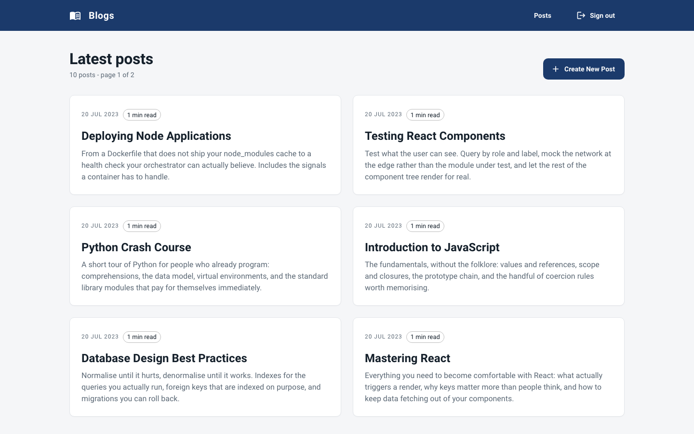
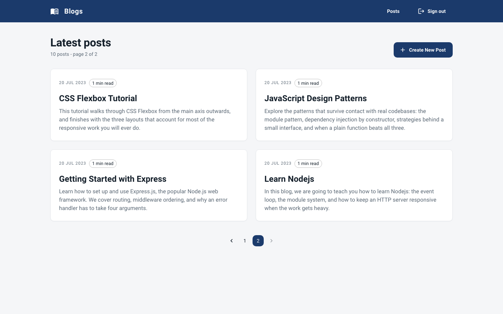
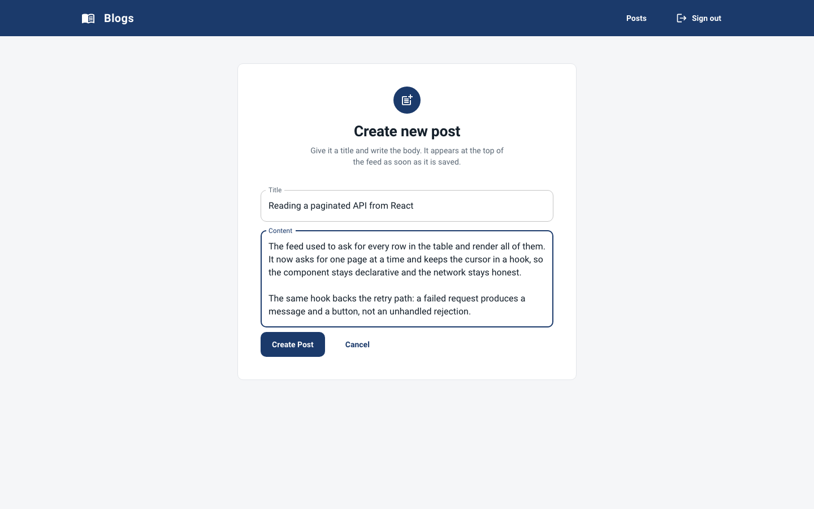
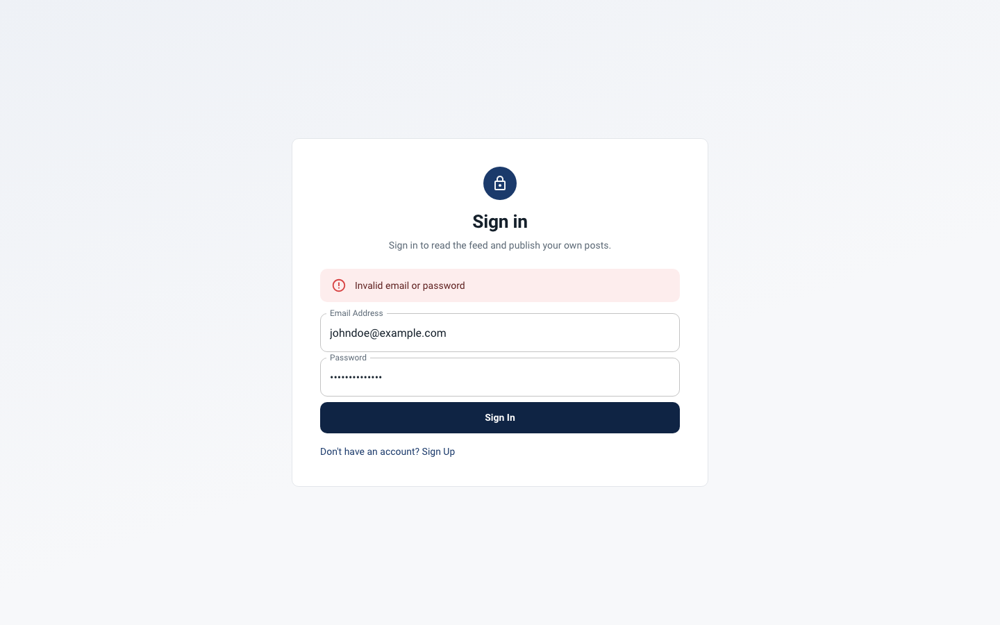
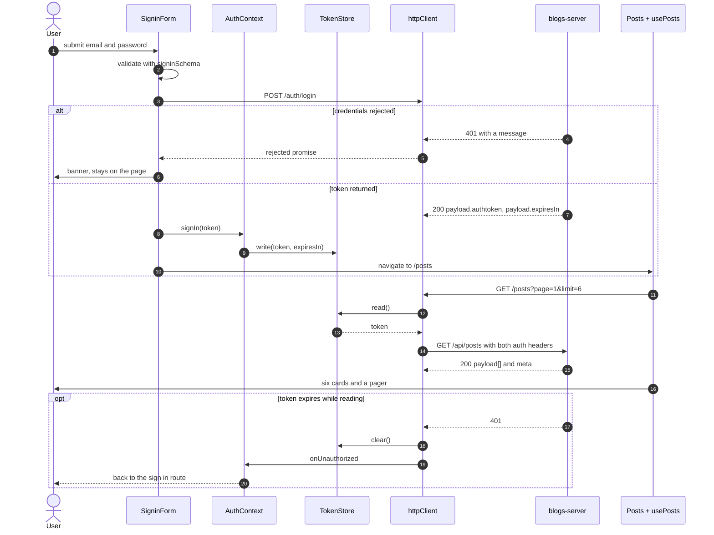
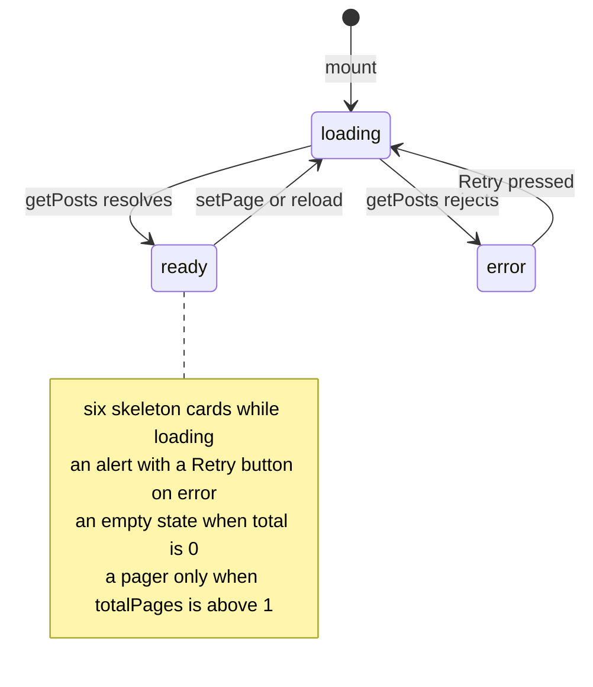

# blogs-web

The React half of a two-repo blog: sign up, sign in for a token, read a paginated feed of
everyone's posts, publish your own. Four routes, three forms and one list, written in
TypeScript on Create React App with Material UI, talking to
[`blogs-server`](https://github.com/TCMS31/blogs-server) and to nothing else.

It keeps exactly one piece of state of its own — the access token. Everything else the UI
knows, including whether you are signed in, is derived from that token or fetched with it.

## What it looks like

Four captures at 1440x900, taken against [`scripts/mockApi.mjs`](scripts/mockApi.mjs) — the
bundled stand-in for `blogs-server`, seeded with ten posts.

| The feed, page 1 of 2 | Page two, pager visible |
| --- | --- |
|  |  |

| The editor, with a draft in it | A sign in the API rejected |
| --- | --- |
|  |  |

## Run it in two terminals

No database needed. `scripts/mockApi.mjs` is a dependency-free Node server that speaks the
same envelope, `meta`, `authtoken` header and validation messages as the real API, and
resets when you stop it.

```bash
yarn install

# terminal 1 — the stand-in backend, ten seeded posts
yarn mock-api                                            # http://localhost:8591/api

# terminal 2 — the app
REACT_APP_API_URL=http://localhost:8591/api yarn start   # http://localhost:3000
```

Sign in as `johndoe@example.com` / `abcd1234`.

Against the real backend instead: start `blogs-server`, set
`REACT_APP_API_URL=http://localhost:8080/api`, and add this app's origin to that server's
`CORS_ORIGINS` or the browser blocks every request.

There is also a multi-stage `Dockerfile` (node build stage that runs lint and build, then
nginx 1.27 as an unprivileged user on port 8080 with an SPA fallback and a healthcheck) and
a `docker-compose.yml` that publishes it on `8590`. `docker compose config` parses. **The
image has never been built or booted** — the project's own build report records
`Build verified: NOT RUN — deferred, Docker off` and the same for boot, so treat the
container path as written-but-unexercised.

## What this client calls

| Call | Made by | What it reads back |
| --- | --- | --- |
| `POST /api/auth/signup` | the sign up form | `payload` — the new user |
| `POST /api/auth/login` | the sign in form | `payload.authtoken`, `payload.expiresIn` |
| `GET /api/posts?page=&limit=` | the feed, on mount and on every page change | `payload[]` plus `meta` of `total`, `page`, `limit`, `totalPages` |
| `POST /api/posts` | the editor | `payload` — the created post |

Every response goes through one type, `Envelope<T>` in `src/types/envelope.ts`, so unwrapping
`payload` happens in the service layer and never in a component. `PageMeta` mirrors the
server's `meta` field for field.

Two details worth knowing before you read the code:

- **Both auth headers go out.** The request interceptor sets `authtoken` *and*
  `Authorization: Bearer <token>`. `blogs-server` prefers `Bearer` and falls back to
  `authtoken`, which is the header the original contract used — sending both means the
  client works either way.
- **The page size is 6, and always explicit.** `DEFAULT_PAGE_SIZE` lives in
  `src/types/pagination.ts`, and `getPosts` sends `page` and `limit` on every request. The
  server has a default page size of its own, and this client never lets it apply. There is
  also a `title` substring filter the server supports and `getPosts` forwards, unused so far.

## The token, and everything derived from it

`TokenStore` (`src/services/tokenStore.ts`) is the one seam in the app: an interface of
`read` / `write` / `clear`, a cookie implementation (`SameSite=Strict`, `secure` when the
page is served over TLS), a memory implementation, and `configureTokenStore()` to swap them.
Nothing else in the app touches `document.cookie`. The whole test suite runs on the memory
store, which is the same swap a BFF holding an httpOnly cookie would make.

The HTTP client reads that store in a **request interceptor**, not once at module scope — a
regression test pins it: *"attaches the current token to every request, reading it at request
time"*. Its response interceptor turns any `401` into a token clear plus a notification to
whoever subscribed via `onUnauthorized`. That subscription is why `httpClient` never imports
React: the dependency points from the auth layer down to the client, not back up.



`AuthContext` derives `isAuthenticated` from `tokenStore.read()` rather than keeping a flag
beside the token, so the two cannot disagree when the cookie expires. Two tests hold that
line: *"derives the signed-in state from the stored token, not a separate flag"* and
*"signs the user out when any request comes back 401"*. The router leans on the same value:
`AuthenticatedRoutes` and `UnauthenticatedRoutes` are separate `<Routes>` tables, so a
signed-out visitor never renders a protected route, not even for a frame. Each table loads
its pages with `React.lazy`.

## One page at a time

The feed asks for one page and lets the server slice. `usePosts` owns the page cursor, the
request status and recovery, so `Posts.tsx` stays declarative — it renders whatever state the
hook reports and never touches axios.



An `isActive` guard in the effect drops a result that arrives after the page has already
moved on, so a fast page-flip cannot paint a stale page. `toErrorMessage`
(`src/types/apiError.ts`) is what makes the `error` branch usable: it separates an API
message, a response that carried none, and a request that never got a response at all
(server down, DNS, CORS) — the last of which is the case a bare
`error.response.data.message` throws on.

Why one page matters here, measured against the mock API's ten seeded posts:

```console
GET /api/posts?limit=100      3,993 bytes of JSON
GET /api/posts?limit=6        2,418 bytes of JSON
```

That is roughly 390 bytes per post, so a whole-table response grows with the table while a
six-post page stays flat. The bundle is the less interesting axis: Material UI is shared by
every route, so route-level splitting moves a few kilobytes at best and trimming MUI would be
the real lever.

## Environment variables

| Variable | Required | Default | Purpose |
| --- | --- | --- | --- |
| `REACT_APP_API_URL` | no | `/api` | Base URL of the API, including the `/api` prefix. The same-origin default is what the nginx image expects when the API is proxied under the same host. |
| `PORT` | no | `3000` | Port the dev server binds to. Create React App convention. |
| `WEB_PORT` | no | `8590` | Host port `docker-compose.yml` publishes. |
| `GENERATE_SOURCEMAP` | no | `true` | `false` skips source maps. The Dockerfile sets it. |
| `CI` | no | unset | `true` makes the test runner exit instead of watching, and build warnings fatal. |

Create React App inlines every `REACT_APP_*` value into the JavaScript bundle at build time.
Anyone who opens the page can read them, so no secret may ever go in one. `.env.example`
carries the same warning.

## Day to day

```bash
yarn start        # dev server with fast refresh
yarn test         # jest in watch mode
yarn test:ci      # single run, what CI should use
yarn coverage     # single run with a coverage table
yarn lint         # eslint over src/, zero warnings tolerated
yarn typecheck    # tsc --noEmit
yarn format       # prettier over src/
yarn build        # production bundle into build/
yarn mock-api     # the offline stand-in for blogs-server
```

`yarn test:ci` is 14 suites and 57 tests, and none of them opens a socket:
`src/__mocks__/axios.js` replaces axios for every suite and `src/testUtils/` supplies the
provider wrapper and the response builders. The two suites that need real axios — the HTTP
client's interceptors and `AuthContext`'s 401 handling — call `jest.unmock('axios')` and
install a fake adapter instead.

`src/setupTests.ts` fails any test that writes to `console.error`, so React prop warnings and
`act` violations cannot pile up unnoticed, and it hands every test a fresh memory token store.

## Where things live

```
src/
  components/AppRoutes/   two route tables, chosen by auth state, lazy pages
  components/Forms/       SigninForm, SignupForm, PostForm, FormError
  components/*            Post card and skeleton, TextInput, Header, FormContainer
  contexts/AuthContext    auth state derived from the token
  hooks/                  useAuth, usePosts
  schemas/                Yup rules mirroring the server's
  services/               httpClient, tokenStore, authService, postService
  types/                  envelope, pagination, post, and the error normaliser
  theme.ts                the single MUI theme, created once at module scope
docker/nginx.conf         SPA fallback, cache headers, unprivileged paths
scripts/mockApi.mjs       offline stand-in for blogs-server
```

Tests sit in a `__tests__/` directory beside the thing they test.

## Known gaps

- **No author names on cards.** The API returns `authorId` and offers no user lookup, so a
  card shows a date and a reading estimate instead of a byline. Inventing one would be a lie.
- **No search box**, though the plumbing for `?title=` is already there and forwarded.
- **No edit, no delete, no post detail page.** The API has no endpoint for any of them.
- **The token sits in a cookie JavaScript can read**, because the contract is a header the
  client must set. An httpOnly cookie from a BFF would be better, and `TokenStore` is exactly
  where that change lands.
- **Pagination is offset-based.** Fine at this size, worse than a cursor on a large table
  that is being written to while you page through it.
- **Create React App is unmaintained upstream.** Migrating to Vite is the obvious next move
  and was deliberately left out of the last pass, which kept the framework untouched.
- **The Docker image is unbuilt.** See the note in the run section.
